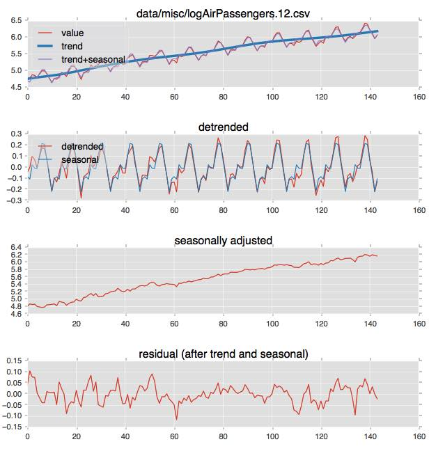
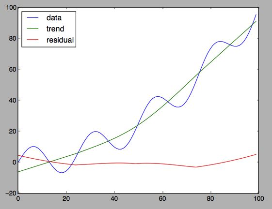
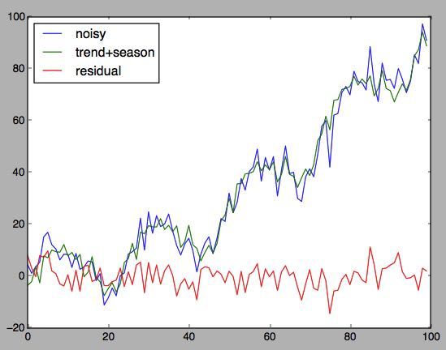
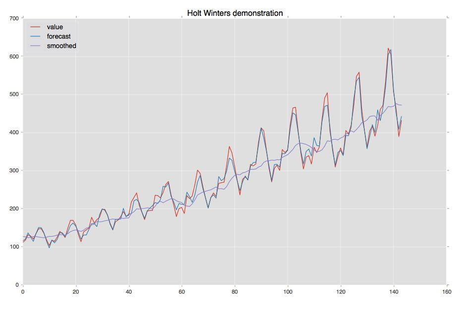

seasonal
========
[![Build Status][travis-image]][travis-url] [![PyPI version][pypi-image]][pypi-url] [![PyPI download][download-image]][pypi-url]

Robustly estimate trend and periodicity in a timeseries.

`Seasonal` can recover sharp trend and period estimates from noisy
timeseries data with only a few periods.  It is intended for
estimating season, trend, and level when initializing structural
timeseries models like Holt-Winters [Hyndman], and its defaults are
biased towards the kinds of training data that arise in that setting. Input
samples are assumed evenly-spaced from a continuous real-valued signal with
additive noise but no anomalies.

The seasonal estimate will be a list of period-over-period averages at
each seasonal offset. You may specify a period length, or have it
estimated from the data. The latter is an interesting capability of
this package. If you're analyzing a single timeseries, you likely know
its seasonality in advance. If you're sifting through a thousand
series, collected at differing sampling rates, automatic period
detection is a real convenience.

Trend removal in this package is in service of isolating and
estimating the periodic (non-trend) variation. A lowpass smoothing of
the data is removed from the original series, preserving original
seasonal variation.  Detrending is accomplishd by a coarse fitted
spline, mean or median filters, or a fitted line.

In an addition to a python API for estimating seasonal offsets for
your timeseries models, the seasonal package also provides executables
to process CSV files from the command line:

  * `seasonal` -- trend and seasonal decomposition
  * `seasonal.trend` -- trend decomposition only
  * `seasonal.periodogram` -- periodogram for raw or detrended data

It is not the aim of this package to construct explanatory models for
complete data sets as these commands do in their demonstration data
sets. You would be _much_ better served building a proper STL or
ARIMA model in R. But these executables are convenient for exploring
seasonal's behavior and for troubleshooting surprises during use.

Quick Start
-----------

```
> pip install seasonal
> seasonal --demo
```


_(note: you'll need to have matplotlib installed for this demo. It is
not a formal dependency, as it is only needed when commands are given
options that produce graphical output)_

To install in-place so you can run tests and play with the included data sets:
```
> git clone git@github.com:welch/seasonal.git
> cd seasonal
> pip install -e .
> py.test -sv
.... (test output) ...

# let's analyze the classic air passenger data
> seasonal data/misc/logAirPassengers.12.csv
period  %TEV    %EEV    N   cycles  file
12      90.99   89.18   144 12      data/misc/logAirPassengers.12.csv

# specify --plot to get a visualization (or --csv to get csv output)
> seasonal --plot data/misc/logAirPassengers.12.csv
```


Example usage (Python)
------------
```
>>> import math
>>> import numpy as np
>>> from seasonal import fit_seasons, adjust_seasons
>>> import matplotlib.pyplot as plt
>>>
>>> # make a trended sine wave
>>> s = [10 * math.sin(i * 2 * math.pi / 25) + i * i /100.0 for i in range(100)]
>>>
>>> # detrend and deseasonalize
>>> seasons, trend = fit_seasons(s)
>>> adjusted = adjust_seasons(s, seasons=seasons)
>>> residual = adjusted - trend
>>>
>>> # visualize results
>>> plt.figure()
>>> plt.plot(s, label='data')
>>> plt.plot(trend, label='trend')
>>> plt.plot(residual, label='residual')
>>> plt.legend(loc='upper left')
```

```
>>>
>>> # how about with some noise?
>>> noisy = s + np.random.normal(0, 5, len(s))
>>> seasons, trend = fit_seasons(noisy)
>>> adjusted = adjust_seasons(noisy, seasons=seasons)
>>> residual = adjusted - trend
>>>
>>> plt.figure()
>>> plt.plot(noisy, label='noisy')
>>> plt.plot(noisy - residual, label='trend+season')
>>> plt.plot(residual, label='residual')
>>> plt.legend(loc='upper left')
```


See docstrings for `fit_seasons()`, `adjust_seasons()`, `fit_trend()`,
`adjust_trend()` for much more detail. And see
`seasonal/application.py:seasonal_cmd()` for code that creates
various combinations of detrended/deseasonalized series.

Forecasting Example
-------------------

Sample code that uses `seasonal` to initialize seasonal and trend
state in a Holt-Winters model is in [`examples/hw.py`](https://github.com/welch/seasonal/blob/master/examples/hw.py). The
`estimate_state()` function is the important thing; the rest is just
enough of a Holt-Winters implementation to demonstrate it.

You can run this from the seasonal directory like this:
```
> python examples/hw.py --demo
||seasons|| = 52.891
estimated alpha=0.361, beta=0.043, gamma=0.882
RMSE =  12.1125827022
final ||seasons|| = 248.801
```


This demo uses the classic air passenger data. The seasonality is
multiplicative, but our model is additive. The initial 20% of the data
is used to estimate the seasonal offsets, and the Holt-Winters updates
gradually increase the magnitude of the seasonality to track the
multiplicative changes. Try this with different values for --split (10
is so brief that no seasonality can be estimated, while 1.0 fits the
initial state to the entire data set, leading to large errors in the
early timesteps)

Seasonal commands
-----------------

Although intended for use from within a python forecasting program,
the package is provided with three executables: `seasonal`,
`seasonal.trend`, and `seasonal.periodogram`. Each of these reads CSV
files and can generate graphical or CSV output.

```
> seasonal -h
Usage: seasonal [options] csv-files...

Summarize trend and seasonality in a timeseries to stderr. The TEV (trend
explained variance) is the in-sample variance removed by detrending. The EEV
(expected explained variance) is the cross-validated out-of-sample detrended
variance explained by seasonality.

Options:
  --version        show program's version number and exit
  -h, --help       show this help message and exit
  --column=COLUMN  csv column to use (name or 0-based index, default
                   rightmost)
  --split=SPLIT    split data at the split*100%  or int(split) point and use
                   the intial segment
  --trend=TREND    trend function (line, mean, median, spline). Default is
                   spline.
  --thresh=THRESH  Periodogram periods must score above thresh*maxscore
                   (default 0.9)
  --minev=MINEV    reject seasonality if it does not explain this percentage
                   of variance. Default is 0.05
  --period=PERIOD  seasonally adjust using this period
  --csv            write adjusted timeseries to stdout as CSV
  -p, --plot       display trend and seasonality using matplotlib

```

```
> seasonal.trend -h
Usage: seasonal.trend [options] csv-files...

Summarize trend in a timeseries to stderr. The %EV (explained variance) is the
in-sample variance removed by detrending.

Options:
  --version        show program's version number and exit
  -h, --help       show this help message and exit
  --column=COLUMN  csv column to use (name or 0-based index, default rightmost
  -p, --plot       display trend results using matplotlib
  --trend=TREND    trending function (line, mean, median, spline). Default is
                   spline
  --period=PERIOD  with --trend, adjust trend while preserving variation at
                   this periodicity (default based on data length)
  --split=SPLIT    split data at the split*100%  or int(split) point and use
                   the intial segment
  --csv            write adjusted timeseries to stdout as CSV

```

```
> seasonal.periodogram -h
Usage: seasonal.periodogram [options] csv-files...

Display a periodogram, optionally detrending first.

Options:
  --version        show program's version number and exit
  -h, --help       show this help message and exit
  --column=COLUMN  csv column to use (name or 0-based index, default
                   rightmost)
  --thresh=THRESH  Retain periods scoring above thresh*maxscore (default 0.9)
  -p, --plot       display using matplotlib
  --trend=TREND    trending function (line, mean, median, spline). If
                   specified, perform an initial detrending using this filter
  --period=PERIOD  with --trend, adjust trend while preserving variation at
                   this periodicity (default based on data length)
  --split=SPLIT    split data at the split*100%  or int(split) point and use
                   the intial segment

```

Theory
------

#### Trend Estimation

When initializing a timeseries model, it is customary to first detrend
the training data by fitting a linear trend.  But linear trend fitting
with periodic data can be hazardous -- the trend you get depends on
where you start and stop in the periodic cycle (as a simple
demonstration, try linear regression on a few cycles of a sine
wave). In this package, if a linear trend is selected, we use a broad
median filter [Tukey] to knock down variations at the maximum expected
period or less, and the Theil-Sen estimator [Sen] to robustly fit a
slope to the result.

More usefully, trend forms other than straight lines can be specified.
"Trend" is in the sense of Cleveland's STL decomposition [Cleveland]
-- a lowpass smoothing of the data that, when removed from the
original series, preserves original seasonal variation. Such
detrending is accomplishd by a coarse fitted spline, mean or median
filters, or a fitted line.

The default trend model uses piecewise cubic splines. The optional
median filter is a useful alternative, as it preserves edges and
prevents impulses from distorting the baseline signal level. Try
`seasonal.trend` on data/NAB/art_daily* with `--trend median` for a
demonstration of this. It would be interesting to autoselect between
these two trend models based on signal characteristics. Send me your
data!

#### Seasonality and Period Estimation

Seasonality is represented as an offset for each seasonal interval.
This is the same representation as is used in Holt-Winters. The
representation does not enforce any kind of continuity from season to
season, which is either a strength (sharp transitions are possible) or
a weakness (noise is less efficiently rejected).  Seasonal offsets for
a given periodicity are estimated as period-over-period averages using
all the provided data.

Estimating the period itself is less straightforward. Although a
variety of techniques exist that operate in the frequency domain, they
lean heavily on sinusoidal decomposition [Quinn] and don't recover
sharp estimates for the short, noisy sequences we often get in model
training sets. This package instead uses a time-domain approach that
accommodates any periodic signal shape.

The period estimator tests a range of plausible periodicities for best
fit to the detrended data. It is formulated as a model selection
problem using cross-validated residual errors [Hastie].  The strength
of the seasonal effect is also considered, using the R^2 of the
leave-one-out cross-validation. For the seasonal model used here, this
is the expected fraction of variance (after detrending) explained by
the best seasonal estimate.

The time-domain approach is expensive (O(n^2)). As an optional
optimization, we first estimate a range of likely periods using a
fast, robust periodogram averaging technique
[Welch (no relation to the author)].  This works well for all our
tests and examples, but its calibration is ad-hoc and there are surely
classes of signal or levels of noise that will fool it. The
`seasonal.periodogram` command provides a good visualization of this
part of the computation.

References
----------

* [Cleveland] Cleveland, et al, "STL: A Seasonal-Trend Decomposition Based on
  Loess", http://cs.wellesley.edu/~cs315/Papers/stl%20statistical%20model.pdf
* [Hastie] Hastie, Tibshirani, and Friedman, _The Elements of Statistical
  Learning (2nd ed)_, eqn 7.52, Springer, 2009
* [Hyndman] Hyndman and Athanasopoulosh, _Forecasting: Principles and Practice_,
  https://www.otexts.org/fpp
* [Quinn] Quinn and Hannan, _The Estimation and Tracking of Frequency_,
  Sec. 6.2.3, Cambridge University Press, 2001
* [Sen] P.K. Sen, "Estimates of the regression coefficient based on
  Kendall's tau", J. Am. Stat. Assoc., Vol. 63, pp. 1379-1389, 1968.
* [Tukey] Tukey, J. W., _Exploratory Data Analysis_, Pearson, 1977
* [Welch] Welch, P.D. (1967) "The Use of Fast Fourier Transform for the
  Estimation of Power Spectra: A Method Based on Time Averaging Over Short,
  Modified Periodograms", IEEE Transactions on Audio Electroacoustics,
      AU-15, 70–73.

Dependencies
-------------
package: numpy, scipy
extras:  pandas, matplotlib

[travis-image]: https://travis-ci.org/welch/seasonal.svg?branch=master
[travis-url]: https://travis-ci.org/welch/seasonal
[pypi-image]: http://img.shields.io/pypi/v/seasonal.svg
[download-image]: http://img.shields.io/pypi/dm/seasonal.svg
[pypi-url]: https://pypi.python.org/pypi/seasonal
